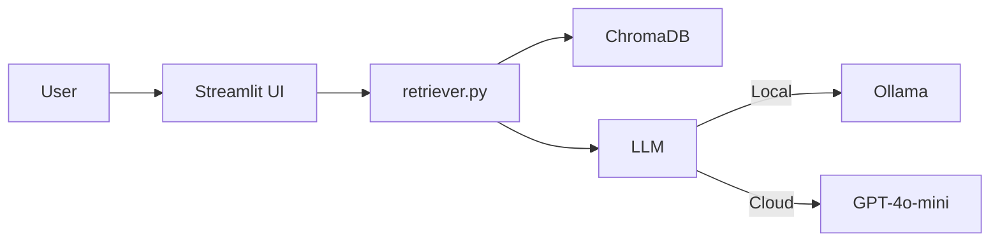

# ServiZurich Policy Manager Assistant

An AI-powered chatbot that helps users understand, navigate, and manage their ServiZurich Insurance policies using Retrieval-Augmented Generation (RAG).

## Architecture



## Quick Start

### 1. Install dependencies

```bash
pip install -r requirements.txt
```


### 2. Choose your mode

**Option A - Local mode (default, free, no API key):**

### 1. Install dependencies

```bash
brew install ollama # if you haven't go it yet
```
then

```bash 
# start the service
brew services start ollama
```
```bash
# Pull the model
ollama pull llama3.2
```

finally, run the app:

```bash
streamlit run app.py         # Embeddings download automatically on first run
```

**Option B - OpenAI mode (best quality, requires API key):**

```bash
export OPENAI_API_KEY="sk-..."
export ASSISTANT_MODE="openai"
streamlit run app.py
```

You can also switch modes in the Streamlit sidebar at runtime.

### 3. That's it

The app auto-ingests the sample policy documents on first load. Click a suggested question or type your own.

when you are done with the project, stop the servive to free you RAM

```bash
#stop service
brew services stop ollama
```

## Project Structure

```
policy-manager-assistant/
├── app.py              # Streamlit chat UI
├── ingest.py           # Document loading, chunking, embedding pipeline
├── retriever.py        # Query → Retrieve → Answer chain
├── eval.py             # Automated test suite (accuracy, conciseness, grounding)
├── config.py           # All tuneable parameters (centralized)
├── sample_docs/        # Synthetic ServiZurich-style policy documents
│   ├── home_policy.txt
│   ├── auto_policy.txt
│   └── health_policy.txt
├── requirements.txt
└── README.md
```

## Key Design Decisions

| Decision | Choice | Why |
|----------|--------|-----|
| Framework | LangChain | Granular control over each pipeline step; explainable |
| Vector Store | ChromaDB | Local, zero-infra, metadata filtering, pip-installable |
| Embeddings | OpenAI or sentence-transformers | Factory pattern: swap provider via config, not code |
| LLM | GPT-4o-mini or Llama 3.2 (Ollama) | Local mode = zero friction for demo; OpenAI = production quality |
| Chunking | Recursive, 500 chars, 50 overlap | Respects clause boundaries; captures full policy clauses |
| Retrieval | MMR, k=4 | Balances relevance and diversity across policy sections |
| Memory | Last 5 exchanges | Insurance sessions are short; prevents context pollution |
| UI | Streamlit | Demo-focused; AI pipeline is the value, not frontend |


## Sample Policy Documents

### AI-Generated Disclaimer

The three policy documents in `sample_docs/` were generated by AI for the sole purpose of demonstrating this RAG pipeline. They are **not** real ServiZurich Insurance policies and should not be interpreted as actual insurance advice or contractual terms.

### Impact on Evaluation

Because these documents were generated by an LLM, there are characteristics worth noting that would not be present in real-world policy documents:

**Structural uniformity.** All three documents follow an identical 6-section structure (Coverage → Exclusions → Deductibles → Claims → Renewal → General Conditions). Real insurance documents vary significantly in structure, terminology, and formatting across product lines and jurisdictions. This uniformity makes the chunking and metadata extraction easier than it would be in production, where the ingestion pipeline would need to handle inconsistent layouts, embedded tables, PDF formatting artefacts, and multi-language documents.

**Predictable language patterns.** AI-generated text tends to use consistent phrasing and sentence structures. This can artificially inflate retrieval accuracy because the embedding model encounters less lexical variation - a query about "deductibles" will closely match chunks that use that exact term repeatedly. Real policy documents use more diverse and sometimes archaic legal language ("excess", "franchise", "retention"), abbreviations, and cross-references that make semantic matching harder.

**Clean separation of concerns.** Each section in these documents covers exactly one topic with minimal overlap. Real policies frequently have cross-references ("subject to the conditions in Section 4.2"), nested exceptions ("except where Clause 7.1(b) applies"), and riders or endorsements that modify base terms. This clean separation means the retriever rarely needs to assemble context from multiple distant chunks - a challenge that production RAG systems must solve.

**What this means in practice:** the evaluation scores achieved against these synthetic documents represent an **upper bound**. A production deployment against real Zurich policy documents would likely see lower initial retrieval precision and require additional tuning of the chunking strategy, metadata extraction, and prompt engineering. The architecture and evaluation framework, however, are designed to handle this - the continuous improvement loop (Section 7 of the proposal) exists precisely to close this gap iteratively.

### Document Overview

The three documents follow a consistent 6-section structure that maps directly to the metadata filters used by the retrieval pipeline:

| Document | Words | Sections |
|---|---|---|
| `home_policy.txt` | ~2,200 | Coverage (buildings, contents, valuables, alt. accommodation, liability), Exclusions, Deductibles, Claims, Renewal, General Conditions |
| `auto_policy.txt` | ~2,600 | Coverage (comprehensive, third-party, personal accident, windscreen, roadside, replacement vehicle, legal expenses), Exclusions, Deductibles, Claims, Renewal, General Conditions |
| `health_policy.txt` | ~3,000 | Coverage (inpatient, outpatient, dental, optical, maternity, preventive, emergency abroad, mental health), Exclusions, Deductibles, Claims, Renewal, General Conditions |

### Demo Design Notes

**Cross-policy comparison queries** work naturally - all three documents have deductibles, exclusion patterns, and no claims discount (NCD) schemes that differ in specific ways, so a question like *"Compare deductibles across my policies"* produces a rich, multi-source answer.

**Edge cases for testing refusal** - questions about IVF (excluded in health), cosmetic surgery (excluded), or business use of the car (excluded in auto) should trigger grounded refusal responses citing the specific exclusion clause.

**Citation-friendly structure** - the `SECTION` headers and numbered subsections (1.1, 2.3, etc.) give the retriever clear section labels to cite in responses, e.g. `[Home Policy - Section 3: Deductibles]`.

## Testing & Evaluation

Run the automated evaluation suite:

```bash
python eval.py
```

This runs 11 test cases that check three dimensions:

| Dimension | What it checks | How |
|-----------|---------------|-----|
| **Accuracy** | Correct facts in the answer | Expected keywords must be present |
| **Conciseness** | Response within word limit | Per-question max word count |
| **Grounding** | No hallucination, cites sources | Forbidden phrases absent; source brackets present |

Additional checks: filler phrase detection ("Great question!", "Based on the provided context...") and correct refusal on out-of-scope questions.

Output example:
```
Overall Score: 48/53 (90.6%)
Accuracy:    10/11 tests passed
Conciseness: 11/11 tests passed
No filler:   11/11 tests passed
Grade: A - Production ready
```

Detailed per-question results are saved to `eval_results.json`.

## Production Improvements

- **Hybrid Search**: BM25 + semantic for exact term matching (policy numbers, codes)
- **Re-ranking**: Cross-encoder (Cohere Rerank) after initial retrieval
- **Evaluation**: Golden Q&A dataset + RAGAS metrics (faithfulness, relevance)
- **Azure OpenAI**: EU data residency compliance for ServiZurich
- **Guardrails**: PII detection, off-topic filtering, input validation
- **Caching**: Frequent questions served from cache, skip full pipeline
- **Observability**: LangSmith / LangFuse for retrieval quality tracing
- **Auth & RBAC**: Policy access scoped to authenticated user's policies
